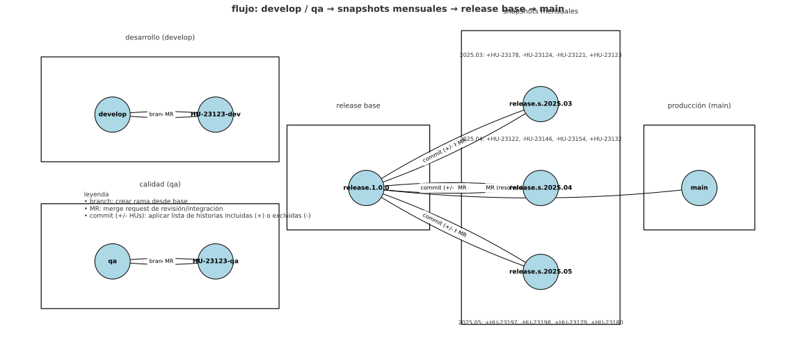

# manual de flujo de ramas, releases y merges

> propósito: documentar cómo se integran cambios desde `develop` y `qa`, cómo se organizan **snapshots mensuales** de release y cómo se promueve a `main` usando versionado semántico.



---

## 1. alcance
- aplica para backend, frontend, data-base y doc.
- cubre: creación de ramas por historia de usuario (HU), pruebas en qa, armado de releases mensuales, control de inclusión/exclusión de HUs y promoción a producción.
- fuera de alcance: estrategia de hotfix en producción (se documenta por separado).

## 2. convenciones de nombres
| tipo | convención | ejemplo | nota |
|---|---|---|---|
| rama HU (dev) | `HU-<id>-dev` | `HU-23123-dev` | nace desde `develop` |
| rama HU (qa) | `HU-<id>-qa`  | `HU-23123-qa`  | nace desde `qa` |
| release base | `release.<semver>` | `release.1.0.0` | línea estable que acumula snapshots |
| snapshot mensual | `release.s.<YYYY.MM>` | `release.s.2025.04` | “tren” mensual con lista de HUs |
| etiqueta (opcional) | `<semver>` | `1.0.0` | al aprobar a `main` |

**semver**: `MAJOR.MINOR.PATCH`  
- **major**: cambios incompatibles.  
- **minor**: nuevas funciones compatibles.  
- **patch**: correcciones y ajustes menores.

## 3. flujo resumido
1) desarrollo: crear `HU-<id>-dev` desde `develop`, trabajar y abrir **MR a `develop`**.  
2) calidad: crear `HU-<id>-qa` desde `qa`, validar y abrir **MR a `qa`**.  
3) release mensual: desde `release.1.0.0` crear **`release.s.YYYY.MM`** y **aplicar commits** con la lista de HUs (+ incluidas, - excluidas/rollback).  
4) consolidación: **MR de cada snapshot** de vuelta a `release.1.0.0`.  
5) corte a producción: **MR `release.1.0.0` → `main`**; resolver conflictos y etiquetar si corresponde.

## 4. ciclo de vida de una HU
1. **plan** (ticket en board): definir alcance, criterios de aceptación y pruebas.  
2. **dev**: rama `HU-<id>-dev`; commits siguiendo conventional commits.  
3. **MR a develop**: revisión por pares y pipeline verde.  
4. **qa**: rama `HU-<id>-qa` para pruebas; datos de prueba, endpoints y scripts.  
5. **MR a qa**: validación funcional y no funcional (seguridad, rendimiento).  
6. **lista de release**: si está aprobada, se marca **+HU-<id>** en el snapshot correspondiente; si se pospone o revierte, **-HU-<id>**.

## 5. armado de snapshots mensuales
- crear o reusar `release.s.YYYY.MM` al inicio del mes.  
- aplicar commits con el payload de historias (ejemplos):  
  - 2025.03: `+HU-23178, -HU-23124, -HU-23121, +HU-23123`  
  - 2025.04: `+HU-23122, -HU-23146, -HU-23154, +HU-23132`  
  - 2025.05: `+HU-23197, -HU-23198, +HU-23179, +HU-23180`  
- al cierre del ciclo, abrir **MR de `release.s.YYYY.MM` → `release.1.0.0`**.

### criterios de inclusión
- ✔ cobertura de pruebas ≥ 80 % (o umbral acordado).  
- ✔ pipelines verdes en dev y qa.  
- ✔ checklist de seguridad (lint, deps, secret scan) pasado.  
- ✔ documentación y migraciones listas.  
- ✖ excluir si hay deuda crítica abierta o regresiones.

## 6. promoción a producción
- preparar **MR `release.1.0.0` → `main`**.  
- resolver conflictos (registrar en el MR como *resolved conflict*).  
- ejecutar *smoke tests* post-deploy.  
- etiquetar versión (opcional): `1.0.0` o `v1.0.0`.  
- comunicar *change log* y responsables.

## 7. comandos útiles (git)
```bash
# crear rama HU para dev
git checkout develop
git pull
git checkout -b HU-23123-dev

# abrir MR (ejemplo gitlab cli)
glab mr create --source HU-23123-dev --target develop -t "HU-23123 dev" -l "backend"

# snapshot mensual desde release base
git checkout release.1.0.0
git pull
git checkout -b release.s.2025.04
# aplicar payload (ej.: cherry-pick de HUs aprobadas)
# git cherry-pick <commit1> <commit2> ...

# consolidar snapshot a la base
# abrir MR release.s.2025.04 → release.1.0.0

# promover a producción
git checkout release.1.0.0
git pull
# abrir MR release.1.0.0 → main
```

## 8. checklist de MR
- título y descripción claros (referenciar tickets HU).  
- etiquetas correctas (backend, frontend, doc, data-base).  
- pipeline verde y cobertura ok.  
- reviewers asignados y *assignee* definido.  
- *change log* actualizado.

## 9. troubleshooting rápido
- **conflictos frecuentes entre snapshots**: alinear base (`release.1.0.0`) antes de abrir nuevos snapshots; privilegiar *cherry-pick* y revert limpios.  
- **HU aprobada pero no aparece**: verificar payload del snapshot (`+HU-<id>`), o si fue marcada con `-HU-<id>` por rollback.  
- **versionado confuso**: documentar cambios *breaking* en el MR y decidir si sube `major` o `minor` antes del corte a `main`.

## 10. métricas sugeridas
- lead time por HU y por release.  
- tasa de rollback por snapshot.  
- % de automatización de pruebas por servicio.  
- defectos en producción por versión.

---

**referencia visual**: el diagrama anterior muestra columnas por etapa, flechas etiquetadas (`branch`, `MR`, `commit (+/- HUs)`), y ejemplos reales de payloads para 2025.03–2025.05.