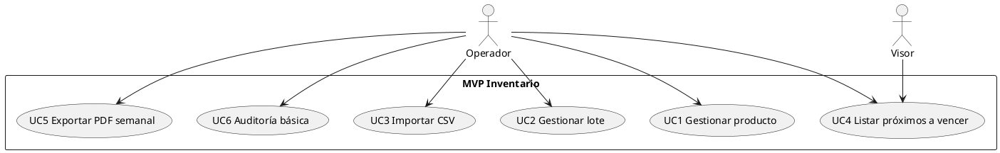

# PROMPT MAESTRO — Proyecto Académico (POO/IS)  
## Gestión de Inventario para Control de Productos Próximos a Vencer (Web: Spring Boot + Angular + PostgreSQL)

> **Instrucción:** Usa este prompt como documento guía para alinear a profesor y equipo. Contiene objetivo, alcance, tiempos, costo, épicas, criterios de aceptación, y artefactos a producir. Completa los campos marcados con `<>` si aplica.

---

## 1) Contexto y problema
- En <tipo de bodega/empresa> se presentan pérdidas por productos vencidos.
- No existe un mecanismo sistemático de **priorización, alerta y seguimiento** de fechas de vencimiento.
- Se requiere un **MVP académico** que demuestre valor y permita extender requisitos que surjan durante el desarrollo.

## 2) Objetivo de impacto (medible)
- **Reducir** el stock vencido al menos **≥20%** en un piloto de **4 semanas**, mediante priorización y alertas.
- **Exactitud** de las alertas **≥95%** (reglas de semáforo).
- **Rendimiento**: p95 de respuestas **< 1 s** en listados de hasta **5.000** ítems.

> Alternativa si el curso exige construcción explícita: “Diseñar e implementar un **MVP** (web) para gestionar inventario y alertas de caducidad, validando métricas de exactitud/rendimiento en entorno local.”

## 3) Alcance (Incluye / No incluye)
**Incluye (MVP):**
- CRUD de productos y lotes (lote, fecha_vencimiento, cantidad, costo, ubicación).
- Importación CSV con validación de plantilla.
- Tablero con **semáforos** (rojo <7 días; ámbar 7–30; verde >30).
- Filtros por rango de días a vencer; exporte **PDF** semanal (Top N).
- Roles básicos (operador, visor). Auditoría mínima (quién creó/editó).

**No incluye (MVP):**
- Integración con POS/ERP, multi-sede, app móvil, modo offline.
- Trazabilidad sanitaria avanzada, control de calidad por laboratorio.
- Algoritmos de predicción (se deja como línea futura).

## 4) Criterios de aceptación (globales)
- CA1: Regla de semáforo implementada y testeada (rojo/ámbar/verde).
- CA2: Importación con plantilla CSV y reporte de errores por fila.
- CA3: Reporte PDF semanal con Top 20 próximos a vencer.
- CA4: p95 < 1 s en lista con 5.000 registros (dataset sintético).
- CA5: Cobertura de pruebas unitarias ≥ 70% en backend (servicios/reglas).
- CA6: Manual de usuario y demo grabada (3–5 min).

## 5) Arquitectura de referencia
- **Backend:** Spring Boot (Java 17), REST, Maven/Gradle, JPA/Hibernate, Validations.
- **Frontend:** Angular (v17+), RxJS, Material o Tailwind, Lazy modules.
- **DB:** PostgreSQL (índices por `expiration_date`, `batch_code`, `product_id`).
- **Auth:** (Opcional) Keycloak/JWT (o seguridad simple por filtros).
- **DevOps:** Docker Compose (local), scripts de seeds, CI básico con tests.

## 6) Modelo de dominio (borrador inicial)
**Entidades principales:**
- `Product(id, sku, name, category, unit, min_stock, supplier_id)`
- `Batch(id, product_id, batch_code, expiration_date, quantity, cost, location)`
- `StockMovement(id, batch_id, type[IN|OUT|ADJ], qty, created_at, note)`
- `Supplier(id, name, contact)`
- `User(id, username, role)`

**Índices sugeridos:**
- `idx_batch_expiration_date(expiration_date)`
- `idx_batch_product(product_id, expiration_date)`

> **Vista/materializada:** `v_near_expiry(product_id, days_to_expire, priority)` para acelerar tableros.

## 7) Casos de uso (MVP)
- UC1 Registrar/editar **producto** (con validaciones).
- UC2 Registrar **lote** con fecha de vencimiento.
- UC3 **Importar CSV** de lotes/productos (plantilla).
- UC4 **Listar y filtrar** próximos a vencer por rango/semáforo.
- UC5 **Exportar PDF** semanal (Top N con detalles).
- UC6 **Auditar** cambios básicos (quién/cuándo).

## 8) Artefactos de entendimiento (Épica 1)
- **Base de datos**: DER inicial + script DDL v0.
- **Diagrama de clases (dominio)**.
- **Diagrama de dominio** (bounded context MVP).
- **Diagrama de casos de uso** (UC1–UC6).
- **Especificación de API** (OpenAPI/Swagger).

### Plantillas (borradores en PlantUML)
**Diagrama de clases (ejemplo mínimo):**
```plantuml
@startuml
class Product { +id: UUID +sku: String +name: String +category: String +unit: String +min_stock: int +supplierId: UUID }
class Batch { +id: UUID +productId: UUID +batchCode: String +expirationDate: Date +quantity: int +cost: decimal +location: String }
class StockMovement { +id: UUID +batchId: UUID +type: MovementType +qty: int +createdAt: datetime +note: String }
class Supplier { +id: UUID +name: String +contact: String }
Product "1" -- "0..*" Batch
Batch "1" -- "0..*" StockMovement
Supplier "1" -- "0..*" Product
@enduml
```

**Casos de uso (ejemplo mínimo):**


---

## 9) Roadmap por épicas (iterativo y extensible)
> **Nota:** A partir de la **Épica 2** se trabaja **en paralelo**: Backend (Spring Boot) y Frontend (Angular). Cada épica cierra con demo y feedback, pudiendo sumar requisitos emergentes.

### ÉPICA 1 — Descubrimiento, modelo y arquitectura (Semana 1)
- **BE/FE:** Setup de repos, CI local, Docker Compose (db + app), seed de datos.
- **Modelado:** DER, clases, dominio, casos de uso, OpenAPI.
- **Entrega:** DDL v0, diagramas, API contract v0, plan de pruebas.
- **DoD:** Swagger disponible; scripts de creación DB; diagramas versionados.

### ÉPICA 2 — Fundaciones y catálogos (Semana 2)
- **Backend:** Entidades JPA `Product`, `Supplier`; CRUD + validaciones; seed.
- **Frontend:** Módulo `catalogs`: listado, creación/edición, formularios reactivos.
- **QA:** Unit tests servicios 60%+; e2e mínimo de navegación.
- **DoD:** CRUDs operativos con validaciones y mensajes claros.

### ÉPICA 3 — Lotes y reglas de vencimiento (Semana 3)
- **Backend:** `Batch`, reglas `days_to_expire`, prioridad (rojo/ámbar/verde); endpoints de consulta paginada + filtros.
- **Frontend:** Tablero semáforo, filtros por rango; detalle de lote/producto.
- **DoD:** Exactitud en cálculo de prioridad ≥95% con dataset sintético.

### ÉPICA 4 — Importación CSV y manejo de errores (Semana 4)
- **Backend:** Endpoint de importación; validación de plantilla; reporte de errores.
- **Frontend:** Wizard de importación con pre-visualización y feedback por fila.
- **DoD:** Importa 5.000 filas en < <tiempo objetivo> con registro de errores.

### ÉPICA 5 — Reportería y rendimiento (Semana 5)
- **Backend:** Reporte semanal PDF (Top N) y endpoint; índices y vistas.
- **Frontend:** Generación/descarga de PDF; paginación y búsqueda avanzada.
- **DoD:** p95 < 1 s en listados de 5.000; PDF listo con totales y agrupaciones.

### ÉPICA 6 — Calidad, seguridad y demo final (Semana 6)
- **QA:** Pruebas unitarias ≥70% back; smoke e2e front; linters/formatters (PEP8 equiv. Java/TS).
- **Sec/Obs:** Manejo de roles básico; logs estructurados; README y manual de usuario.
- **Entrega:** Demo final + informe comparando métricas vs. objetivo.

> **Extensiones futuras (post-MVP):** Integración POS/ERP, multi-sede, app móvil, predicción de demanda/caducidad, alertas por WhatsApp/Email, dashboards BI.

---

## 10) Cronograma y esfuerzo (estimado)
- **Opción A (6 sprints x 1 semana):** 6 semanas calendario.
- **Opción B (3 sprints x 2 semanas):** 6 semanas calendario con iteraciones más largas.

**Roles (dedicación referencial por semana):**
- BE 10–14 h | FE 10–14 h | QA 4–6 h | UX/BA 2–4 h | Líder/PM 2–4 h.

**Costo (plantilla de cálculo):**
- BE: <$$/h> × <horas>
- FE: <$$/h> × <horas>
- QA: <$$/h> × <horas>
- UX/BA: <$$/h> × <horas>
- PM: <$$/h> × <horas>
- **Total estimado**: suma de lo anterior. *Ajustable por alcance.*

> Supuestos: trabajo académico; no hay costos de nube; ambiente local con Docker; herramientas open-source.

---

## 11) Riesgos y mitigación
- **Datos incompletos/ruidosos:** plantilla CSV y validaciones tempranas.
- **Rendimiento en listados grandes:** índices + paginación + vistas/materialized view.
- **Cambios de alcance:** política “Incluye/No incluye” y control de cambios por anexo.
- **Brecha UX:** prototipos rápidos y feedback semanal (demo por épica).

---

## 12) Definición de Hecho (DoD) y criterios de salida por épica
- Código con tests que pasan en CI local; cobertura mínima por épica.
- Documentación de endpoints (Swagger) y README actualizado.
- Demo funcional y checklist de criterios de aceptación cumplidos.
- Issues cerrados y tareas remanentes documentadas como “futuro”.

---

## 13) Backlog de historias (resumen por épica)
- **E1:** Setup repos/CI, DDL v0, diagramas, OpenAPI v0.
- **E2:** CRUD Product/Supplier (BE/FE), validaciones, seed.
- **E3:** CRUD Batch, cálculo de `days_to_expire`, tablero semáforo.
- **E4:** Importador CSV + validaciones + reporte de errores.
- **E5:** Reporte PDF Top N, filtros avanzados, optimizaciones de consulta.
- **E6:** Tests, seguridad mínima, logging, manual de usuario, demo final.

---

## 14) Plantillas rápidas (para copiar/pegar)

**DDL inicial (PostgreSQL – boceto):**
```sql
CREATE TABLE supplier (
  id UUID PRIMARY KEY,
  name TEXT NOT NULL,
  contact TEXT
);

CREATE TABLE product (
  id UUID PRIMARY KEY,
  sku TEXT UNIQUE NOT NULL,
  name TEXT NOT NULL,
  category TEXT,
  unit TEXT,
  min_stock INT DEFAULT 0,
  supplier_id UUID REFERENCES supplier(id)
);

CREATE TABLE batch (
  id UUID PRIMARY KEY,
  product_id UUID REFERENCES product(id),
  batch_code TEXT NOT NULL,
  expiration_date DATE NOT NULL,
  quantity INT NOT NULL,
  cost NUMERIC(12,2) NOT NULL,
  location TEXT
);

CREATE INDEX idx_batch_exp_date ON batch(expiration_date);
CREATE INDEX idx_batch_prod_exp ON batch(product_id, expiration_date);
```

**Regla de prioridad (pseudocódigo):**
```text
days_to_expire = (expiration_date - today).days
priority = RED if days_to_expire < 7
         = AMBER if 7 <= days_to_expire <= 30
         = GREEN if days_to_expire > 30
```

**Esqueleto de API (REST):**
```text
GET /api/products?page=&size=&q=
POST /api/products
PUT /api/products/{id}
DELETE /api/products/{id}

GET /api/batches?productId=&daysToExpire<=&priority=
POST /api/batches
POST /api/batches:import (CSV)
GET /api/reports/near-expiry?top=20&format=pdf
```

---

## 15) “Promesa” de alcance al profesor (stakeholder)
> Entregar un **MVP web** que registre productos/lotes, priorice por caducidad (rojo/ámbar/verde), permita importar CSV y genere un reporte PDF semanal. Se medirá el éxito por **exactitud ≥95%** en alertas y **p95 < 1 s** con 5.000 registros. El trabajo avanza por **épicas** (1: descubrimiento/modelado; 2–6: funcionalidades) con **backend y frontend en paralelo** desde la épica 2, cerrando cada iteración con demo, métricas y documentación.

---

### Cómo usar este prompt
1) Completa los campos `<...>` y ajusta métricas si tu profesor define otras.  
2) Crea issues por épica/historia en tu repositorio (Git).  
3) Presenta el documento al inicio y actualízalo al final de cada épica.