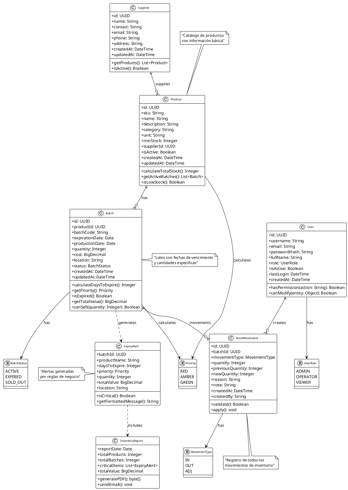
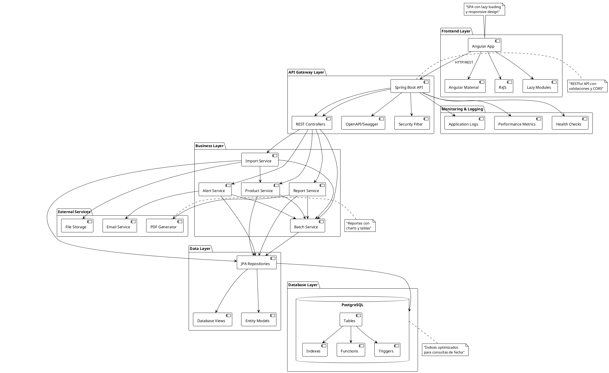
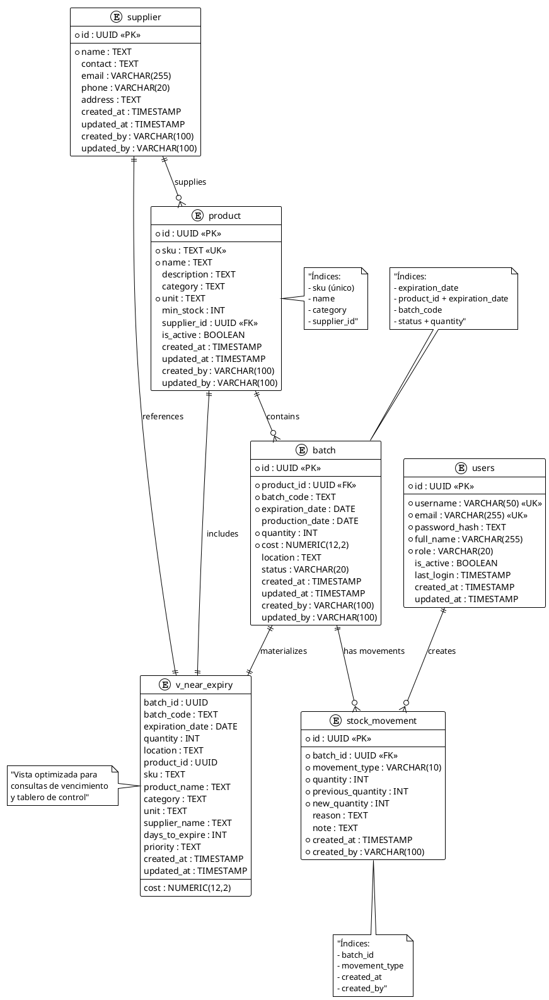
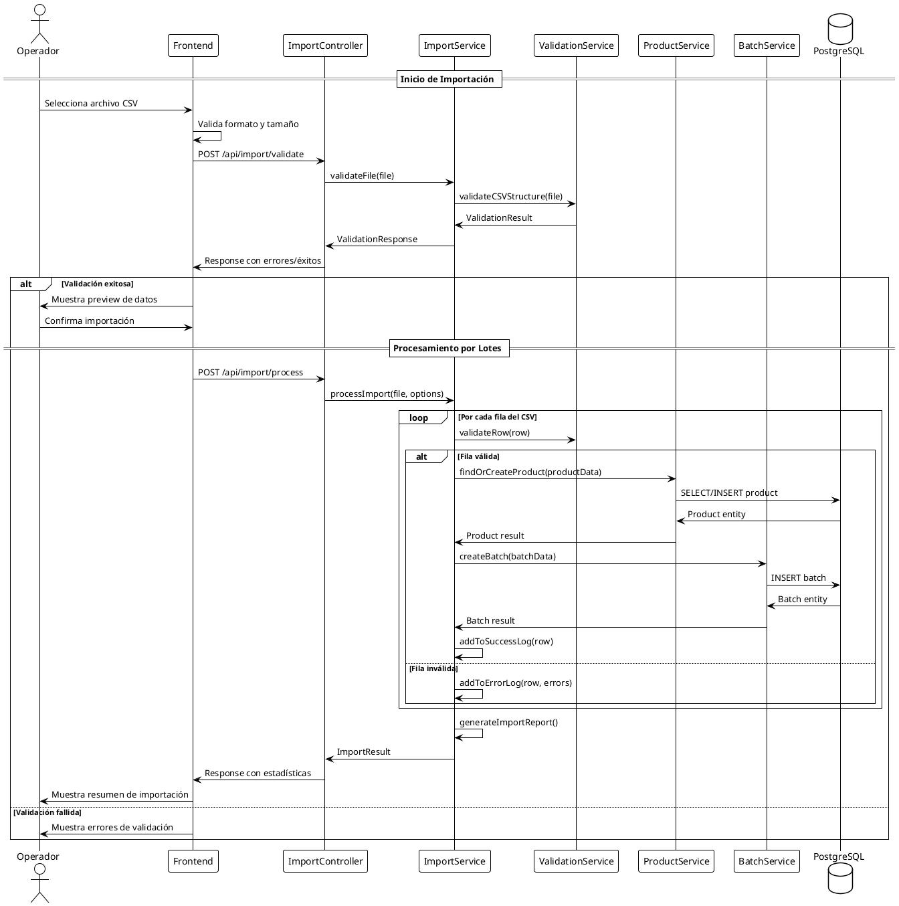

# Diagramas de Arquitectura - Sistema de Gestión de Caducidades

## 1. Diagrama de Clases de Dominio

## 2. Diagrama de Casos de Uso

```plantuml
@startuml Casos_Uso_MVP
!theme plain

' =====================================================
' ACTORES
' =====================================================

actor "Operador" as OP
actor "Visor" as VI
actor "Administrador" as AD

' =====================================================
' SISTEMA
' =====================================================

rectangle "Sistema Gestión Caducidades" {
    
    ' Gestión de Catálogos
    package "Gestión de Catálogos" {
        usecase "UC01\nGestionar Productos" as UC01
        usecase "UC02\nGestionar Proveedores" as UC02
    }
    
    ' Gestión de Inventario
    package "Gestión de Inventario" {
        usecase "UC03\nRegistrar Lotes" as UC03
        usecase "UC04\nActualizar Stock" as UC04
        usecase "UC05\nImportar CSV" as UC05
    }
    
    ' Monitoreo y Alertas
    package "Monitoreo y Alertas" {
        usecase "UC06\nConsultar Próximos\na Vencer" as UC06
        usecase "UC07\nGenerar Alertas\nSemáforo" as UC07
        usecase "UC08\nFiltrar por\nPrioridad" as UC08
    }
    
    ' Reportería
    package "Reportería" {
        usecase "UC09\nGenerar Reporte\nPDF Semanal" as UC09
        usecase "UC10\nExportar Datos" as UC10
    }
    
    ' Administración
    package "Administración" {
        usecase "UC11\nGestionar Usuarios" as UC11
        usecase "UC12\nAuditar Cambios" as UC12
        usecase "UC13\nConfigurar Sistema" as UC13
    }
}

' =====================================================
' RELACIONES PRINCIPALES
' =====================================================

' Operador - Gestión completa
OP --> UC01
OP --> UC02
OP --> UC03
OP --> UC04
OP --> UC05
OP --> UC06
OP --> UC07
OP --> UC08
OP --> UC09
OP --> UC10

' Visor - Solo consulta
VI --> UC06
VI --> UC07
VI --> UC08
VI --> UC09

' Administrador - Acceso total
AD --> UC01
AD --> UC02
AD --> UC03
AD --> UC04
AD --> UC05
AD --> UC06
AD --> UC07
AD --> UC08
AD --> UC09
AD --> UC10
AD --> UC11
AD --> UC12
AD --> UC13

' =====================================================
' RELACIONES ENTRE CASOS DE USO
' =====================================================

UC03 .> UC04 : <<include>>
UC05 .> UC01 : <<include>>
UC05 .> UC03 : <<include>>
UC07 .> UC06 : <<include>>
UC09 .> UC06 : <<include>>
UC12 .> UC04 : <<include>>

' =====================================================
' NOTAS ACLARATORIAS
' =====================================================

note right of UC05 : "Validación de plantilla CSV\ny reporte de errores"

note top of UC07 : "Reglas: Rojo <7 días\nÁmbar 7-30 días\nVerde >30 días"

note bottom of UC09 : "Top 20 productos\npróximos a vencer"

note left of UC12 : "Registro de quién\ny cuándo modificó"

@enduml
```

## 3. Diagrama de Arquitectura del Sistema

## 4. Diagrama Entidad-Relación (DER)

## 5. Diagrama de Secuencia - Importación CSV

## Uso de los Diagramas

Estos diagramas están en formato PlantUML y pueden ser utilizados de las siguientes maneras:

1. **Copiar en herramientas online:**
   - [PlantUML Online](http://www.plantuml.com/plantuml/uml/)
   - [PlantText](https://www.planttext.com/)

2. **Integrar en documentación:**
   - GitLab/GitHub con soporte PlantUML
   - Confluence con plugin PlantUML
   - VS Code con extensión PlantUML

3. **Generar imágenes:**
   - Exportar como PNG/SVG para documentos
   - Incluir en presentaciones del proyecto

## Próximos Pasos

1. Revisar y ajustar los diagramas según feedback del equipo
2. Implementar las entidades del modelo de dominio
3. Crear la especificación OpenAPI detallada
4. Configurar el entorno de desarrollo con Docker
